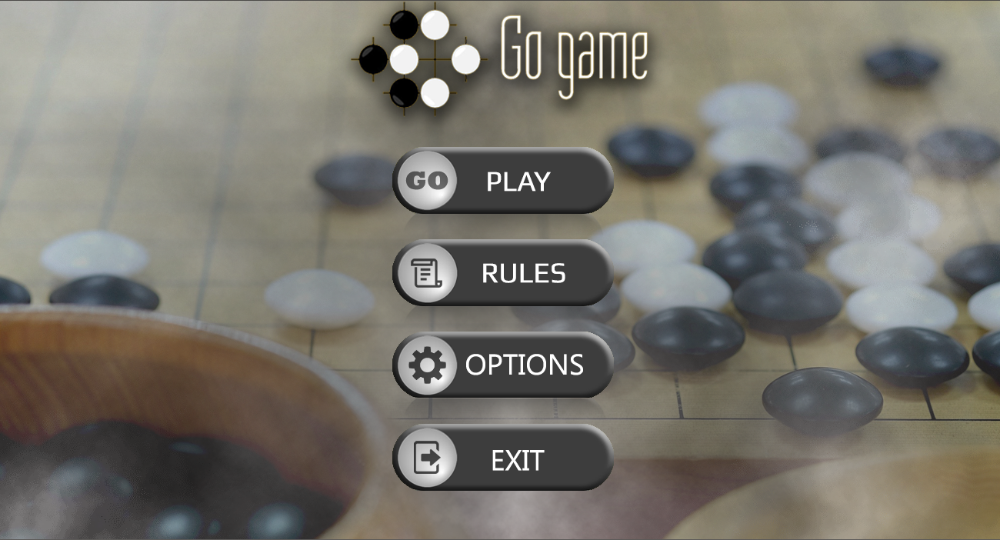
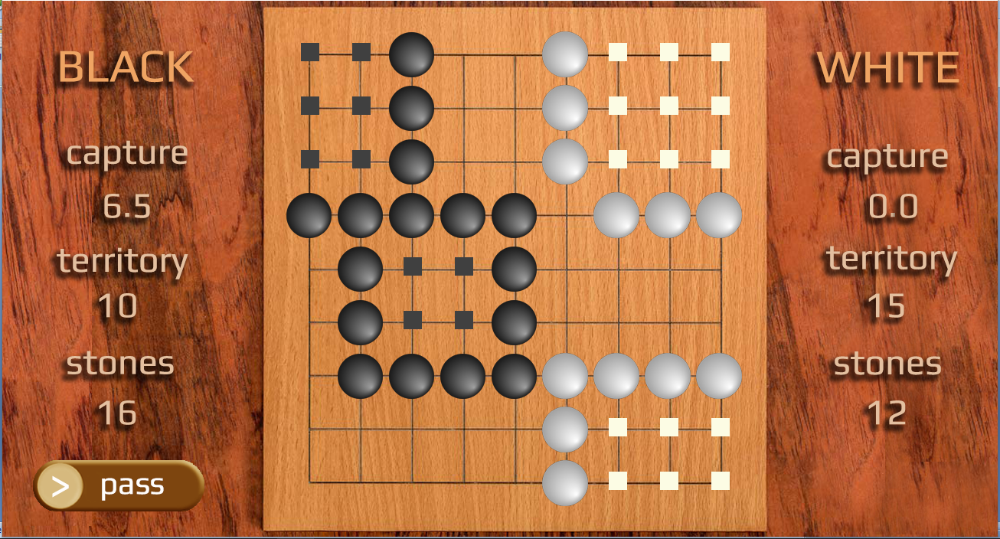
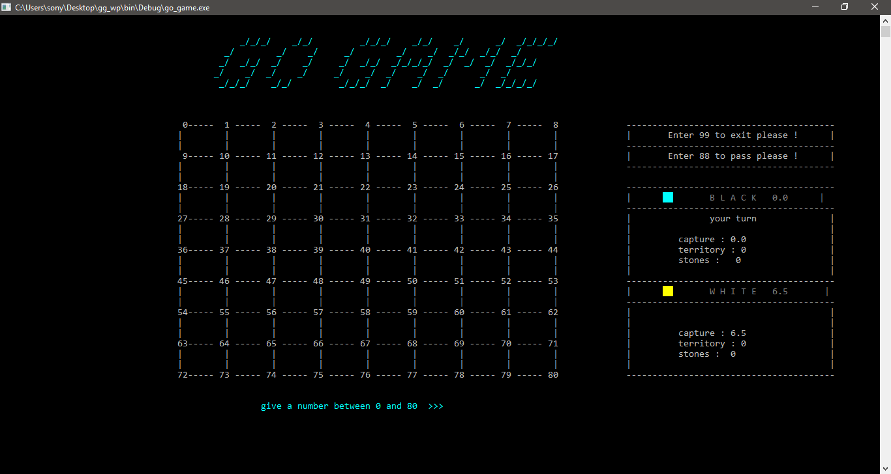

# Go Game with C language :

A graphic and console implementation of the famous GO GAME for educational purposes with C language.

# Description :
Go Game with C language is a game built from scratch for some educational purposes and also to satisfy my curiosity about games developement.
This game repersents my very first contact with coding and developement, so you might find some parts that are not written in an elegant way, you might find some bad structured code, the main objectif was to take my skills from first contact with coding to a higher level

# Dependencies :

To run SDL project, some SDL libraries are needed, we recommande to follow this [great tutorial from lazyfoo](https://lazyfoo.net/tutorials/SDL/) to set up all the needed dependencies.

# Structure :
This repository containes the following :

- A simple [console implementation](./GO_GAME_CONSOLE) of SDL game 
- A [full graphic go game](./GO_GAME_SDL/go) made with SDL library 
- A [report](./rapport_projet_GO-GAME_pdf.pdf) that contains every detail about game developpement and features 

# Copyrights :

This repository is free to use for all purposes, you can redistribute it and/or modify it without any restrictions. 

Please feel free to contact us for any further informations or/and help about this repository. 
If you detected any bugs or you want to suggest some improvements in this go game repository, please feel to submit a pull request or contact me by email <harrymomment@gmail.com>

# Go game board :

This game's board size is 9x9 and contains all the game rules and functionalities.

# Contribution :

Please feel free to fork the repository and make pull requests.

# Closing :

>While the Baroque rules of chess could only have been created by humans, the rules of go are so elegant, organic, and rigorously logical that if intelligent life forms exist elsewhere in the universe, they almost certainly play go. 

-- Edward Lasker
